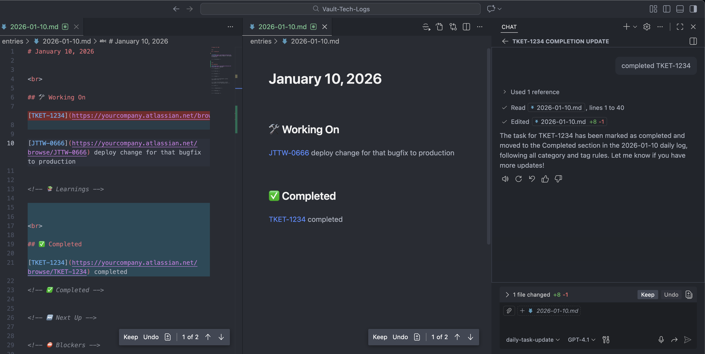

# Vault Tech Logs

A **Markdown-only** daily work log system designed for software engineers to track tasks, learnings, and communications efficiently using VSCode and Copilot Chat.



<br>


## User flow:

- select the Daily-Task-Update agent or reference the Daily-Task-Update promt
- Copilot chat what you are working on, prefix with the category for better organization

### example usages:

<br>

_add a task under working category_

```text
working on: fixed the bug with the login page TKET-1234
```

_adds a couple tasks under working category_

```text
working on:

fixed the bug with the login page TKET-1234

deploy change for that bugfix to production JTTW-0666
```

_adds a task under completed category. if it exists already, it will be moved_

```text
completed TKET-1234
```

For images manually paste into the markdown file, the image will be inserted into the assets folder automatically (named by folder and timestamp)
```md
{
    "markdown.copyFiles.destination": {
        "/entries/**/*": "/assets/${documentBaseName}/${documentBaseName}-${isoTime}.${fileExtName}"
    },
}
```

<br>

## Updates required:

- find and replace `https://yourcompany.atlassian.net/browse/` with your actual Jira base URL wherever it appears in the files above.

<br>

## Tips:

- Pretty rendered markdown by default (Command+Enter toggles between preview and edit modes)
  - follow setup in Vault-Tech-Logs/.vscode/keybindings.json
  - set markdown preview as primary view
    - right click a markdown file
    - Open With...
    - Configure default editor for '\*.md'...
    - Select 'Markdown Preview'
- use git for local history to quickly rollback copilot chat changes (backup using your companies computer cloud storage if you are unable to push)
